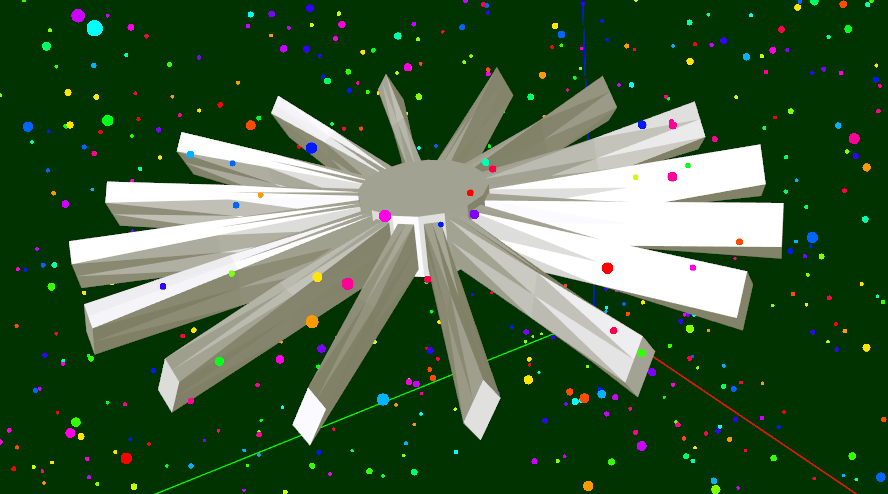

# DPC-experiments
This repository hosts experiments with DPC++ (Data Parallel C++).

For more information on DPC++, see https://software.intel.com/content/www/us/en/develop/documentation/oneapi-programming-guide/top/oneapi-programming-model/data-parallel-c-dpc.html

# DPCDemo
## Purpose
DPCDemo is a particle simulator to test fan performance

https://devmesh.intel.com/projects/fan-efficiency-particle-simulation

While work on DPCDemo has concluded, there are many improvements that can be made. For more information, see the DevMesh project post for this project: https://devmesh.intel.com/projects/fan-efficiency-particle-simulation



## Usage
1. Build (See "Building" below)
2. Run `DPCDemo.exe`
   - Specify `--device <device_type>` to use a different device. 
   - Specify `--input <input-file>` to specify a different fan to test the performance of.

### Running on DevCloud
1. Build using the "Building in DevCloud" section below.
2. `make run` to run locally.

**Queue run on a CPU**
1. `qsub -d . devcloud-run-cpu.sh`
2. Watch for the STDOUT output file to be created from the run.
3. `nano devcloud-run-cpu.sh.oABCDEF` to inspect the output!

**Queue run on a GPU**
1. `qsub -l nodes=1:gpu:ppn=2 -d . devcloud-run-gpu.sh`
2. Watch for the STDOUT output file to be created from the run.
3. `nano devcloud-run-gpu.sh.oABCDEF` to inspect the output!

**Queue run on an FPGA**

Unfortunately this application appears to be too large to build for an FPGA:
```
$ dpcpp SimConstants.h Simulation.h Simulation.cpp Random.h Random.cpp RandData.h RandData.cpp Particle.h Particle.cpp ModelLoader.h ModelLoader.cpp FanMesh.h ExitingParticle.h DPCDemo.cpp DeviceQuerier.h DeviceQuerier.cpp -Idevcloud-dep/include -std=c++17 -fintelfpga -Xshardware
Out of memory in module quartus_sh (1023 megabytes used).
...
dpcpp: error: fpga compiler command failed with exit code 1 (use -v to see invocation)
$
```

**Sample DevCloud Output (CPU)**
See the following files:
- [devcloud-run-cpu.sh.o788403](devcloud-gpu-cpu-output/devcloud-run-cpu.sh.o788403)
- [devcloud-run-cpu.sh.o788406](devcloud-gpu-cpu-output/devcloud-run-cpu.sh.o788406)
- [devcloud-run-cpu.sh.o788411](devcloud-gpu-cpu-output/devcloud-run-cpu.sh.o788411)


**Sample DevCloud Output (GPU)**
See the following files:
- [devcloud-run-gpu.sh.o788410](devcloud-gpu-cpu-output/devcloud-run-gpu.sh.o788410)
- [devcloud-run-gpu.sh.o788414](devcloud-gpu-cpu-output/devcloud-run-gpu.sh.o788414)
- [devcloud-run-gpu.sh.o788419](devcloud-gpu-cpu-output/devcloud-run-gpu.sh.o788419)

## Building
Because DPCDemo relies on locally-installed technologies, there's no release -- you'll need to build DPCDemo from source using the instructions below.

### Build Locally (Windows, Visual Studio Community 2019)
1. Install the Intel oneAPI DPC++/C++ compiler
   - See https://software.intel.com/content/www/us/en/develop/documentation/get-started-with-dpcpp-compiler/top.html for more information.
2. Get 'vcpkg' to install dependent libraries
   - `git clone https://github.com/microsoft/vcpkg.git`
   - `cd vcpkg`
   - `bootstrap-vcpkg.bat`
3. Install dependent libraries using 'vcpkg' and integrate them into Visual Studio
   - `vcpkg install glew:x64-windows glfw3:x64-windows glm:x64-windows imgui:x64-windows libigl[imgui]:x64-windows magic-enum:x64-windows stb:x64-windows argparse:x64-windows`
   - `vcpkg integrate install`
4. Download this repository
   - `git clone https://github.com/GuMiner/DPC-experiments.git`
5. Open in Visual Studio, build, and run!
   - Edit `SimConstants.h` to change any settings as desired.

### Building in DevCloud 
**Setup**
1. `ssh devcloud`
2. `git clone https://github.com/GuMiner/DPC-experiments`
3. `cd DPC-experiments/DPCDemo`
4. `nano SimConstants.h` and set *ENABLE_GUI* to 0

**Queue build**
1. `qsub -d . devcloud-build.sh`
- If this is running into problems (for instance, if 'a.out' isn't generated), locally run `devcloud-build.sh` or `make all`
2. `watch -n 1 qstat -n -1`
- This will show the status of the build job, if running.

## Inspiration
This application was inspired by the [The Great Cross Architecture Challenge](https://www.codeproject.com/Competitions/1098/The-Great-Cross-Architecture-Challenge).

## Results
For more information on these results and what they mean, see https://devmesh.intel.com/projects/fan-efficiency-particle-simulation
### Fan 1
```
Average exit position: (5.11432, 4.95538, 4.86139), with 2571 particles in 3000 steps.
Directional Energy Flow: (445944, 1.0109e+06, -984544).

Mesh Mass: 1.67721
Energy Transfer Performance Score: 8.69596e+06
Directionality Performance Score: 1.4799e+06
Done.
``` 

### Fan 2
```
Average exit position: (5.12642, 4.95672, 4.89277), with 2605 particles in 3000 steps.
Directional Energy Flow: (2.16341e+06, 1.02154e+06, -2.96457e+06).

Mesh Mass: 3.1188
Energy Transfer Performance Score: 1.68226e+07
Directionality Performance Score: 3.80954e+06
```

### Fan 3
```
Average exit position: (5.17131, 4.91061, 4.90695), with 2616 particles in 3000 steps.
Directional Energy Flow: (1.27706e+06, 324654, 102937).

Mesh Mass: 3.27381
Energy Transfer Performance Score: 3.03571e+07
Directionality Performance Score: 1.32169e+06
```
