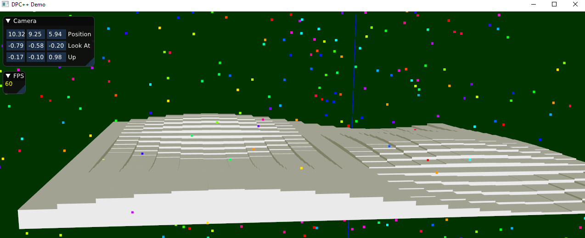

# DPC-experiments
This repository hosts experiments with DPC++ (Data Parallel C++).

For more information on DPC++, see https://software.intel.com/content/www/us/en/develop/documentation/oneapi-programming-guide/top/oneapi-programming-model/data-parallel-c-dpc.html

# DPCDemo
## Purpose
DPCDemo is a particle simulator to test fan performance.

DPCDemo is still a work in progress.

## Usage
TODO add to this section once there is a terminal interface.

## Building
Either download DPCDemo from (this link TODO) or build it using the steps below

### Build Locally (Windows, Visual Studio Community 2019)
1. Install the Intel oneAPI DPC++/C++ compiler
   - See https://software.intel.com/content/www/us/en/develop/documentation/get-started-with-dpcpp-compiler/top.html for more information.
2. Get 'vcpkg' to install dependent libraries
   - `git clone https://github.com/microsoft/vcpkg.git`
   - `cd vcpkg`
   - `bootstrap-vcpkg.bat`
3. Install dependent libraries using 'vcpkg' and integrate them into Visual Studio
   - `vcpkg install glew:x64-windows glfw3:x64-windows glm:x64-windows imgui:x64-windows libigl[imgui]:x64-windows magic-enum:x64-windows stb:x64-windows`
   - `vcpkg integrate install`
4. Download this repository
   - `git clone https://github.com/GuMiner/DPC-experiments.git`
5. Open in Visual Studio, build, and run!
   - Edit `SimConstants.h` to change any settings as desired.

## Inspiration
This application was inspired by the [The Great Cross Architecture Challenge](https://www.codeproject.com/Competitions/1098/The-Great-Cross-Architecture-Challenge). 